# Project: Python Fake Orders

> by Filipe Macedo 10 July 2023

## 1. Project Description

This is the first required project in a total o of three to reach the certificate at How Data Engineer Bootcamp. The main objective here is to build an ETL pipeline that create fake data and extracts this data from the local machine and save in S3 using JSON or CSV format, crawl the data using GLUE crawlers and use ATHENA to visualize the data.

In the figure bellow you can see the arquitecture of the proposed solution.

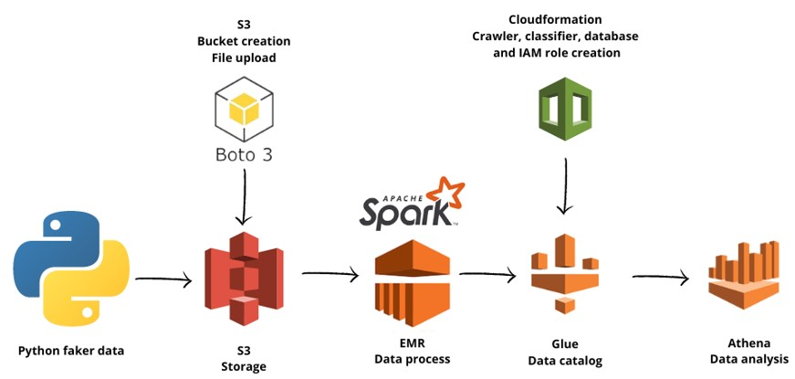

## 2. Data

We'll be working with files in the JSON format. Each file represent one created order containing information related the product, customer, payment and even delivery address, as we can see in the example bellow:

```
{
    "order_id": "b8a74fd8-1860-11ee-8856-00155da06f4f",
    "order_total": 59999,
    "product_info": {
        "product_id": "a6ac104b-2379-4584-b66a-483d84143b9c",
        "product_description": "Tablet Samsung Galaxy"
    },
    "customer_info": {
        "customer_id": "e9121350-5d12-4c85-a0f7-9caa1750243c",
        "customer_name": "Cecília Costa",
        "customer_phone_number": "+55 (081) 7868 5661"
    },
    "payment_info": {
        "payment_type": "credit_card",
        "card_number": "3549382140146378",
        "provider": "American Express",
        "expire": "05/27",
        "security_code": "862"
    },
    "delivery_address": {
        "zip_code": "52799929",
        "country": "Brazil",
        "state": "Maranhão",
        "city": "Fernandes Alegre",
        "street": "Quadra de Ribeiro",
        "number": "86"
    },
    "order_created_at": "2023-05-01 08:52:42"
}
```

The data will be partitioned using the order date:

Partition 2023-05-08:
```
s3://how-desafio/order-data/2023-05-08/2023-05-08-00.json
s3://how-desafio/order-data/2023-05-08/2023-05-08-01.json
...
s3://how-desafio/order-data/2023-05-08/2023-05-08-198.json
s3://how-desafio/order-data/2023-05-08/2023-05-08-199.json
```
Partition 2023-05-09:
```
s3://how-desafio/order-data/2023-05-09/2023-05-09-00.json
s3://how-desafio/order-data/2023-05-09/2023-05-09-01.json
...
s3://how-desafio/order-data/2023-05-09/2023-05-09-198.json
s3://how-desafio/order-data/2023-05-09/2023-05-09-199.json
```

## 3. Running the project

3.1. Configure the AWS CLI, you can use this [link](https://docs.aws.amazon.com/cli/latest/userguide/cli-chap-configure.html);

3.2. Using python run the file `fake_data.py` to create the fake data;

3.3. Using python run the file `upload_s3.py` to create the S3 bucket and upload the files to it;

3.4. Using AWS Console create the EMR cluster to run the pyspark scripts:

3.4.1 Select spark apps to install:
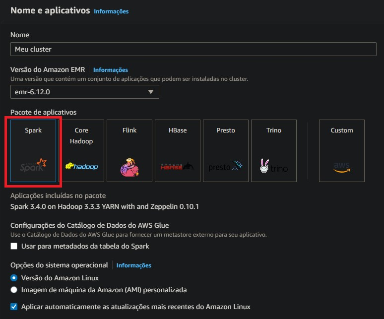

3.4.2 Select the instance type:
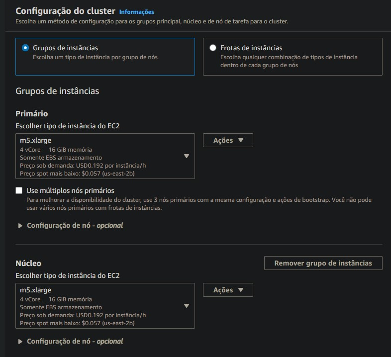

3.4.3 Create the steps in the cluster:
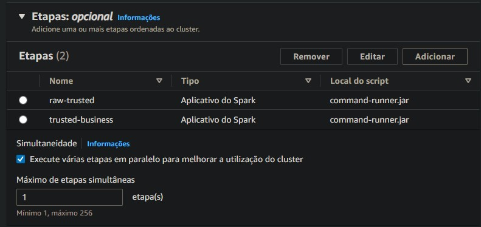
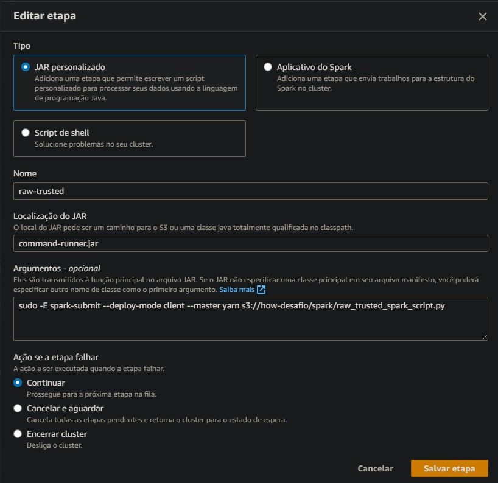

3.4.4 Create the bootstrap actions to run great expectations:
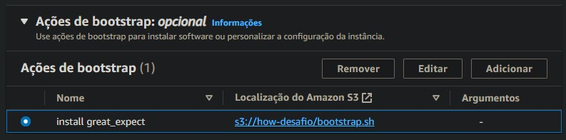
The .sh file containning the following code:
```
#!/bin/bash
sudo python3 -m pip install urllib3==1.26.6
sudo python3 -m pip install great_expectations
```
3.4.5 Configure the IAM access:
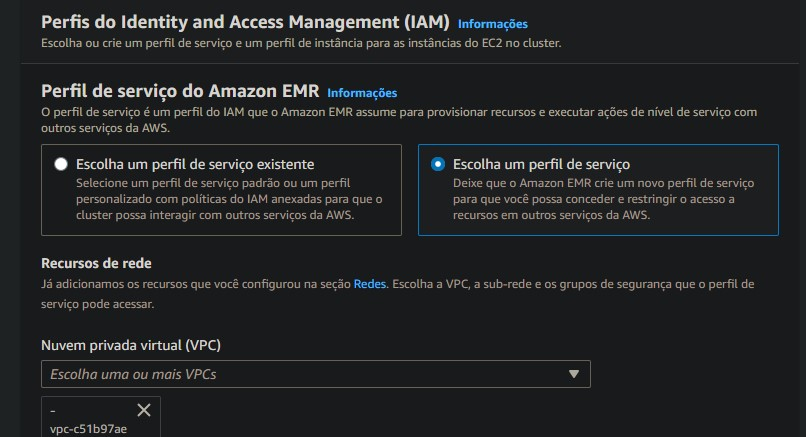
Very important to give access to the S3 buckets
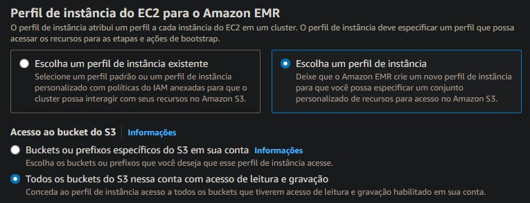

3.4.6 Click in create cluster:

3.4.7 Wait for the steps to finish:
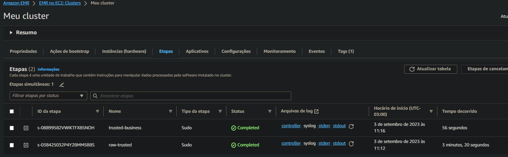

3.5. Using the AWS CLI with the command bellow run the `crawler.yaml` file to create the crawler stack using Cloudformation:

```
aws cloudformation create-stack --stack-name cf-create-crawler-awscli --template-body file://crawler.yaml --capabilities CAPABILITY_NAMED_IAM
 ```

3.6. In the AWS Console run the crawler:

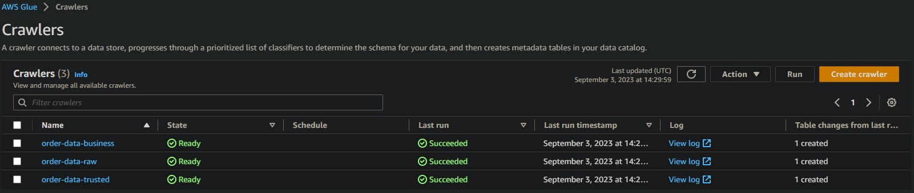

## 4. Using Athen run your querys to export table DDL:

4.1 Trusted orders table:
    

4.2 Business customers table:
    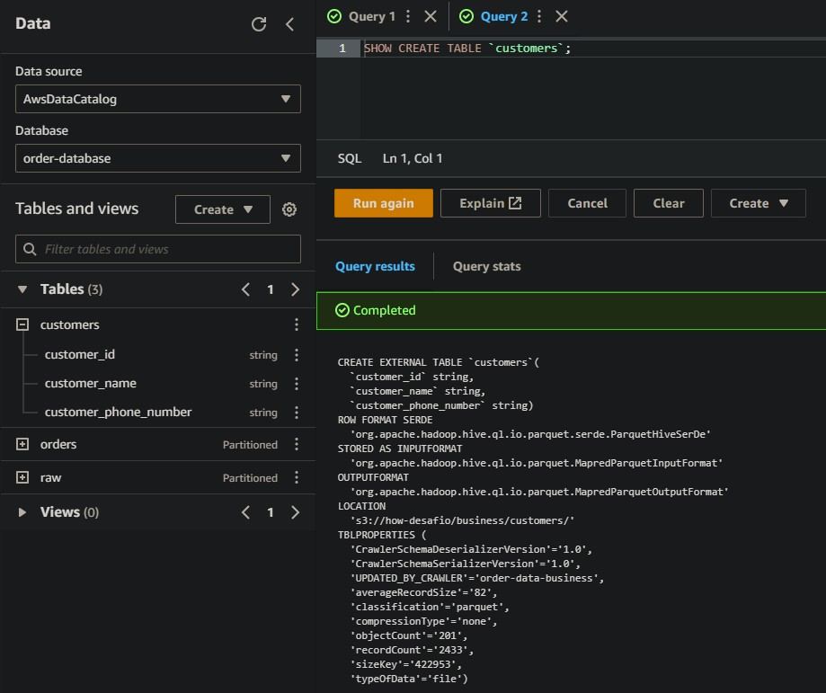
